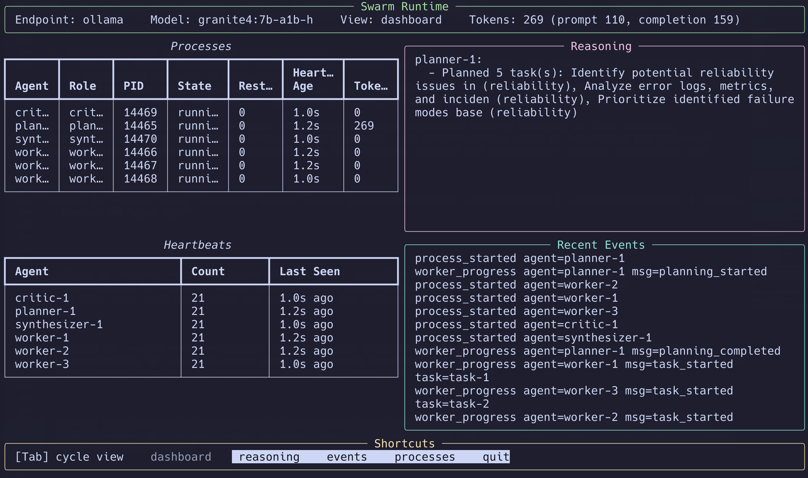

# 🚀 Simple LLM Agent

A lightweight, local AI agent powered by **Ollama**. This tool uses a **ReAct (Reasoning + Action) loop** to not only answer questions but also browse the web and interact with your local filesystem through extensible Python tools.

## 🛠️ Installation & Setup

### 1. Environment

Create a virtual environment and install the required dependencies for browsing and file handling:

```bash
python3 -m venv venv
source venv/bin/activate
pip install -r requirements.txt

```

### 2. Global Alias

Add this to your `.zshrc` or `.bashrc` so you can call the agent from anywhere:

```bash
alias lm='/Users/USERNAME/scripts/llms/simple/venv/bin/python3 /Users/USERNAME/scripts/llms/simple/lm'

```

---

## 💡 How It Works

### **Skills (`/skills`)**

Skill markdown files are repository artifacts/documentation right now. They are not automatically injected into runtime prompts by `lm`.

### **Tools (`/tools`)**

Drop `.py` files here to give the agent "powers." If a tool is present, the agent can autonomously:

* **Search the web** (via DuckDuckGo).
* **List directories** (to see what files you have).
* **Read files** (to analyze your code).
* **Write files** safely inside the current working directory (with overwrite confirmation).

---

## 📖 Usage

### **Standard Prompt**

```bash
lm "Check my current directory and tell me which file is the largest."

```

### **Piped Input (Contextual Analysis)**

You can pipe logs, code, or diffs directly into the agent:

```bash
git diff HEAD | lm "Write a concise commit message for these changes."

```

### **Web Research**

```bash
lm "What are the latest benchmarks for the Granite 4 model?"

```

###**Agent Swarms **

```bash
 python3 lm --swarm --tui --endpoint ollama --model granite4:7b-a1b-h --swarm-workers 3 --swarm-max-reviews 3 --tool-timeout 90 --task-retries 3 --output-format markdown "Audit this repo for reliability issues. Identify top 5 failure modes and prioritized fixes."

```


```bash
python3 lm --swarm --web --web-port 8765 --endpoint ollama --model granite4:7b-a1b-h --swarm-workers 3 --swarm-max-reviews 3 --tool-timeout 90 --task-retries 3 --output-format markdown "Audit this repo for reliability issues."
```

Open `http://127.0.0.1:8765` in your browser for the live swarm dashboard.


---

## 🤝 Contributing

Add new capabilities by creating a new Python script in the `tools/` directory with a defined `SCHEMA` and `execute()` function.

## 📄 License

This project is licensed under the MIT License. See [LICENSE](./LICENSE).
